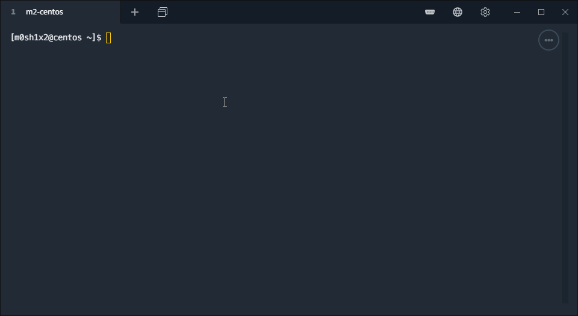

# Task 2
Research and implement a RAID10-like configuration with ZFS and mount it on boot

# Used Sources

- [How to create RAID 10 – Striped Mirror Vdev ZPool On Ubuntu Linux](https://www.cyberciti.biz/faq/how-to-create-raid-10-striped-mirror-vdev-zpool-on-ubuntu-linux/)

# Video Solution



# Documented Text solution
Install and configure zfs

```
sudo dnf install http://download.zfsonlinux.org/epel/zfs-release.el8_1.noarch.rpm
# Enable kmod at /etc/yum.repos.d/
zfs.repo

sudo dnf install zfs
```

Autoload the zfs module

```
echo "zfs" | sudo tee -a /etc/modules-load.d/zfs.conf
```

Create the mirrored pool, aka. RAID 10 alternative

```
sudo zpool create raid10 mirror /dev/sd[b-c] 
sudo zpool add raid10 mirror /dev/sd[d-e]
```

Test if it will be mounted after reboot:

```
echo "Test mount after boot" | sudo tee /raid10/boot.txt
```

Remove the pool
```
sudo zpool destroy raid10
```