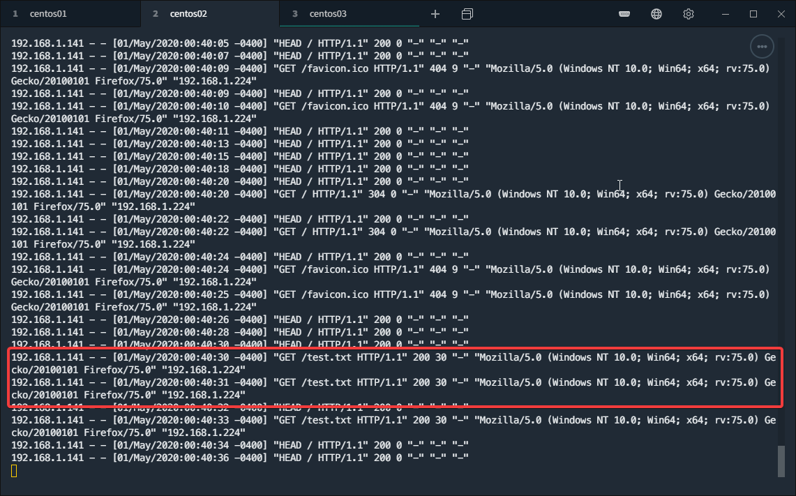
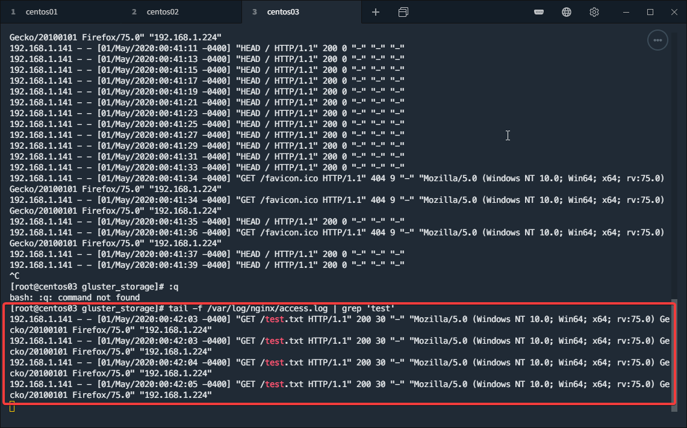

# Task 1
Research and implement two node failover cluster that hosts a web site served by shared (any form) clustered storage

# Used Sources

- [GlusterFS Quickstart](https://docs.gluster.org/en/latest/Quick-Start-Guide/Quickstart/)
- [How to Install and Configure HAProxy on CentOS 8 / RHEL 8](https://www.linuxtechi.com/install-configure-haproxy-centos-8-rhel-8/)
- [How To Set Up an Apache Active-Passive Cluster Using Pacemaker on CentOS 7](https://www.digitalocean.com/community/tutorials/how-to-set-up-an-apache-active-passive-cluster-using-pacemaker-on-centos-7)
- [How to install Apache on RHEL 8 / CentOS 8 Linux](https://linuxconfig.org/installing-apache-on-linux-redhat-8)
- [Configure iSCSI Target & Initiator on CentOS 7 / RHEL7](https://www.itzgeek.com/how-tos/linux/centos-how-tos/configure-iscsi-target-initiator-on-centos-7-rhel7.html)
- [What is ISCSI](https://www.howtoforge.com/iscsi_on_linux)

# Solution

## Arechitecture

- CentOS Server 1
    - Role: LoadBalancer - Haproxy
    - IP: 192.168.1.141
- CentOS Server 2
    - Role: Apache/HTTP host
    - IP: 192.168.1.142
- CentOS Server as Node 2
    - Role: Apache/HTTP host
    - IP: 192.168.1.143

/etc/hosts
```
192.168.1.141 centos01
192.168.1.142 centos02
192.168.1.143 centos03
```

Server1:

```bash
sudo dnf install targetcli -y
targetc
sudo mkdir /var/lib/iscsi-images
sudo targetcli
fdisk /dev/sdb
sudo fdisk /dev/sdb
sudo pvcreate /dev/sdb1
sudo vgcreate vg_iscsi /dev/sdb1
sudo lvcreate -l 100%FREE -n lv_iscsi vg_iscsi
```


Server2:

```bash
sudo dnf install iscsi-initiator-utils -y
vi /etc/iscsi/initiatorname.iscsi
sudo vi /etc/iscsi/initiatorname.iscsi
iscsiadm -m discovery -t st -p 192.168.1.140
sudo iscsiadm -m discovery -t st -p 192.168.1.140
ip a
sudo iscsiadm -m discovery -t st -p 192.168.1.141
sudo systemctl restart iscsid.service
sudo systemctl enable iscsid.service
ls
lsblk
sudo iscsiadm -m node -T iqn.2020-04.centos01.server:disk1 -p 192.168.1.141
sudo iscsiadm -m node login
cat /var/log/messages
sudo cat /var/log/messages
lsblk
iscsiadm -m node -T iqn.2016-02.local.itzgeek.server:disk1 -p 192.168.1.141 -l
sudo iscsiadm -m node -T iqn.2020-04.centos01.server:disk1 -p 192.168.1.141 -l
sudo iscsiadm -m node -T iqn.2020-04.local.centos01.server:disk1 -p 192.168.1.141 -l
lsblk
```

Server3:

```bash


```

Set up GlusterFS on centos01, centos02 and centos03

```
sudo dnf install centos-release-gluster7 -y
sudo dnf config-manager --set-enabled centos-gluster7 -y
sudo dnf config-manager --set-enabled PowerTools -y
sudo dnf install glusterfs-server -y
sudo systemctl enable --now glusterd
sudo firewall-cmd --add-service=glusterfs --permanent
sudo firewall-cmd --reload
sudo mkdir -p /glusterfs/distributed
```

Create the shared drive for each machine
- There is a 25G disk for each machine

```
echo -e "o\nn\np\n1\n\n\nw" | fdisk /dev/sdb
mkfs.xfs -i size=512 /dev/sdb1
mkdir -p /data/brick1
echo '/dev/sdb1 /data/brick1 xfs defaults 1 2' >> /etc/fstab
mount -a && mount

sudo gluster volume create vol01 transport tcp centos01:/data/brick1/storage centos02:/data/brick1/storage centos03:/data/brick1/storage
```

Set up a volume for each server:

```
mkdir -p /data/brick1/gv0

gluster volume create gv0 replica 3 centos01:/data/brick1/gv0 centos02:/data/brick1/gv0 centos03:/data/brick1/gv0
gluster volume start gv0

mount -t glusterfs centos01:/gv0 /mnt
mount -t glusterfs centos02:/gv0 /mnt
mount -t glusterfs centos03:/gv0 /mnt

```


Mount the Storage for the 3 servers

```
sudo mkdir /mnt/gluster_storage

mount -t glusterfs centos01:/gv0 /mnt/gluster_storage/
mount -t glusterfs centos02:/gv0 /mnt/gluster_storage/
mount -t glusterfs centos03:/gv0 /mnt/gluster_storage/

# Disable selinux in order to gain access to the files
# Still missing knowledge on how to do this

sudo setenforce 0

```

Install Haproxy on centos01:

```
dnf install haproxy

# Save the original config file
cd /etc/haproxy
mv haproxy.cfg haproxy.cfg.bkp
```

Set the haproxy load balancing config:

```
vi /haproxy.cfg

frontend haproxynode
    bind *:80
    mode http
    default_backend backendnodes

backend backendnodes
    balance roundrobin
    option forwardfor
    http-request set-header X-Forwarded-Port %[dst_port]
    http-request add-header X-Forwarded-Proto https if { ssl_fc }
    option httpchk HEAD / HTTP/1.1\r\nHost:localhost
    server node1 192.168.1.142:80 check
    server node2 192.168.1.143:80 check

listen stats
    bind :32700
    stats enable
    stats uri /
    stats hide-version
    stats auth someuser:password
```

Nginx config for centos02 and centos03 

```
# The only change is the glusterfs mount at /etc/nginx.conf

server {
        listen       80 default_server;
        listen       [::]:80 default_server;
        server_name  _;
        root         /mnt/gluster_storage/html;
```

Testing the load balancing:

1. Load 192.168.1.141 in the browser.
2. Monitor the access logs for centos02 and centos03:

centos01:



centos02:



Stop nginx on centos02 and check if balancing works:


It does:


