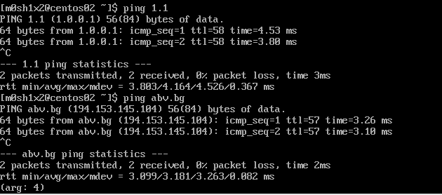
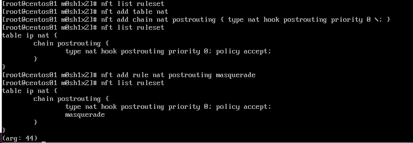

# Task 1
Research and implement two-node network (one machine with two NICs and the second with one) with NAT capabilities based on nftables
# Sources

- [Using nftables in CentOS 8](https://www.theurbanpenguin.com/using-nftables-in-centos-8/)
- [Performing Network Address Translation (NAT)](https://wiki.nftables.org/wiki-nftables/index.php/Performing_Network_Address_Translation_(NAT))
- [RHCSA 8 - Nat Masquerading Natively Using Nftables](https://www.youtube.com/watch?v=Oikhriux0qk)

# Solution


centos02 - client
```
# Add default route on centos02
ip r a default via 192.168.2.1
```

centos01 - server/router

```
sysctl -ar ip_forward
# Enable ip4 forwarding conf
echo 'net.ip4.ip_forward=1' > /etc/sysctl.d/routing.conf
# Reload the sysctl conf
sysctl -p --system

# Disable firewalld
systemctl disable --now firewalld
systemctl mask firewalld

# Check and clear rules
nft list ruleset
nft flush ruleset

nft add table nat
nft add chain nat postrouting { type nat hook postrouting priority 0 \; }

nft add rule nat postrouting masquerade
```

# Screenshots:

## client:



## server:


