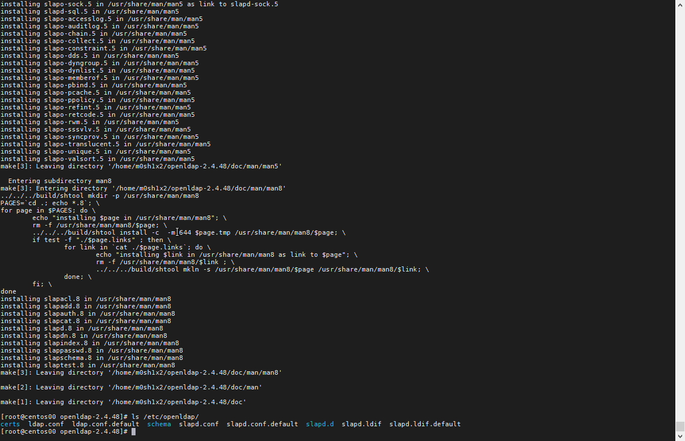
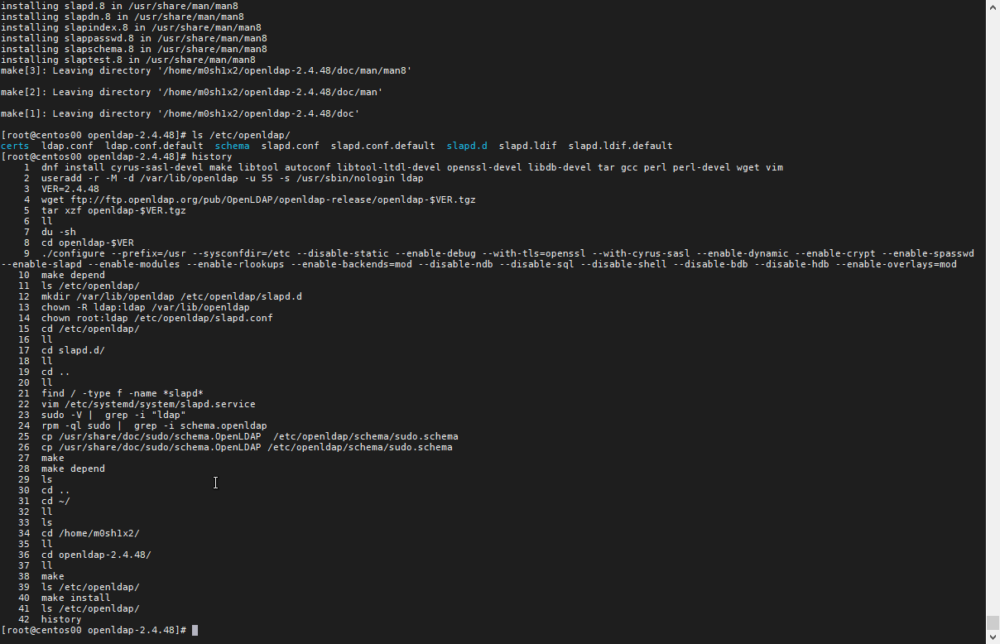
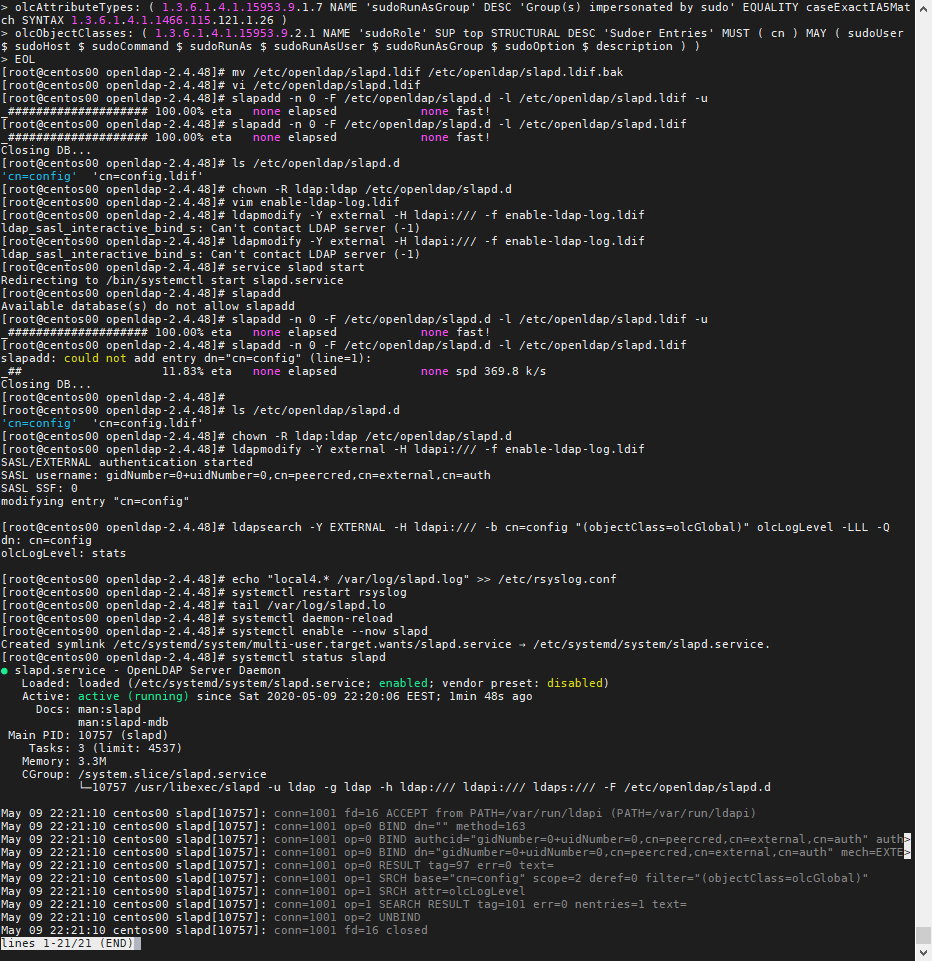

# Task 1

Research and implement an OpenLDAP single-node solution. Create a directory with three users and two groups. One of the users should belong to two groups, while the other two just to one of them

# Used Sources

- [Install and Setup OpenLDAP on CentOS 8](https://kifarunix.com/install-and-setup-openldap-on-centos-8/)

# Solution

# Installation 
```
# Install dependencies
dnf install cyrus-sasl-devel make libtool autoconf libtool-ltdl-devel openssl-devel libdb-devel tar gcc perl perl-devel wget vim
# Create system account
useradd -r -M -d /var/lib/openldap -u 55 -s /usr/sbin/nologin ldap
# Install
VER=2.4.48
wget ftp://ftp.openldap.org/pub/OpenLDAP/openldap-release/openldap-$VER.tgz
tar xzf openldap-$VER.tgz
cd openldap-$VER
./configure --prefix=/usr --sysconfdir=/etc --disable-static \
--enable-debug --with-tls=openssl --with-cyrus-sasl --enable-dynamic \
--enable-crypt --enable-spasswd --enable-slapd --enable-modules \
--enable-rlookups --enable-backends=mod --disable-ndb --disable-sql \
--disable-shell --disable-bdb --disable-hdb --enable-overlays=mod
./configure --help
make depend
make
make test # Optional
make install
```

## Installation screenshot:



## Command history:




Check config files:

```
ls /etc/openldap/

```

## OpenLDAP installed and running




## Configure users

First User:
```
dn: uid=user1,ou=users,dc=softuni,dc=com
objectClass: posixAccount
objectClass: shadowAccount
objectClass: inetOrgPerson
cn: User1
sn: User1
uid: user1
uidNumber: 5000
gidNumber: 5000
homeDirectory: /home/user1
loginShell: /bin/sh
gecos: Comments
```

First User:
```
dn: uid=user1,ou=users,dc=softuni,dc=com
objectClass: posixAccount
objectClass: shadowAccount
objectClass: inetOrgPerson
cn: User2
sn: User2
uid: user2
uidNumber: 5000
gidNumber: 5000
homeDirectory: /home/user2
loginShell: /bin/sh
gecos: Comments
```

First User:
```
dn: uid=user1,ou=users,dc=softuni,dc=com
objectClass: posixAccount
objectClass: shadowAccount
objectClass: inetOrgPerson
cn: User3
sn: User3
uid: user3
uidNumber: 5000
gidNumber: 5000
homeDirectory: /home/user3
loginShell: /bin/sh
gecos: Comments
```