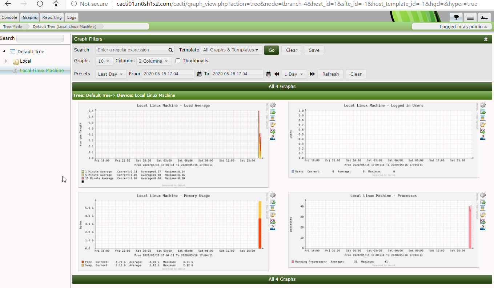
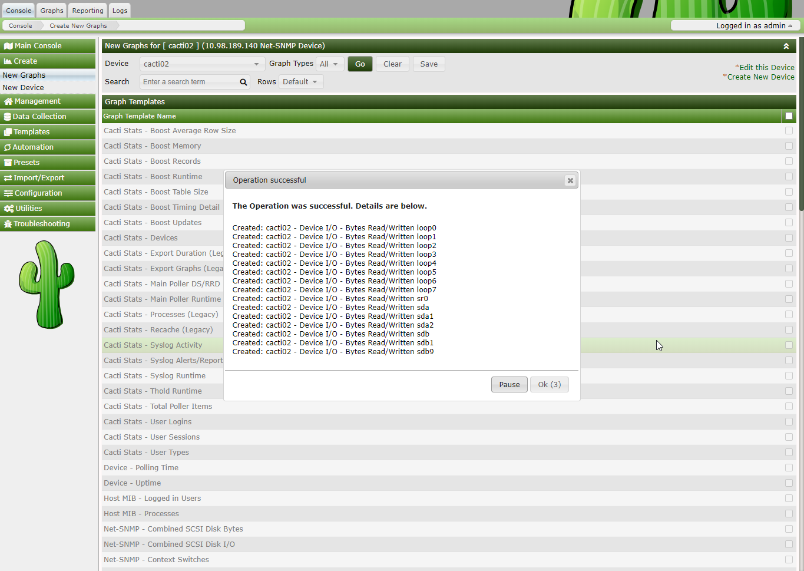
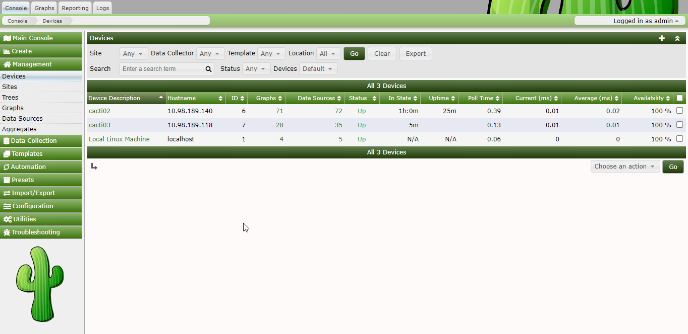

# Task

# Used Sources

- [How To Install Cacti On CentOS 8 / RHEL 8](https://www.itzgeek.com/how-tos/linux/centos-how-tos/how-to-install-cacti-on-centos-8-rhel-8.html)
- [How to Monitor Remote Linux Servers with Cacti](https://www.itzgeek.com/how-tos/linux/how-to-monitor-remote-linux-servers-with-cacti.html)

- [SNMP Timeouts for valid OIDs #143](https://github.com/Cacti/cacti/issues/143)

- [Timeout while trying to query a SNMP server
](https://serverfault.com/questions/865002/timeout-while-trying-to-query-a-snmp-server)

# Solution

Set up 4 LXC containers:

- haproxy
- cacti01
- cacti02
- cacti03

The Haproxy container is forwarding the traffic for the cacti01 main monitoring node.

```
frontend www_frontend
        bind  *:80
        acl host_web1 hdr(host) -i cacti01.m0sh1x2.com
        use_backend web1_cluster if host_web1

backend web1_cluster
        balance  leastconn
        http-request set-header X-Client-IP %[src]
        server cacti01 cacti01.lxd:80 check
```

Via IPTables of course:

```
sudo iptables -t nat -I PREROUTING -i eth0 -p TCP -d 192.168.1.168/24 --dport 80 -j DNAT --to-destination 10.98.189.157:80
```

# Install Cacti on cacti01

```bash
dnf update
dnf install epel-release
yum install -y net-snmp net-snmp-utils net-snmp-libs rrdtool
yum install -y mariadb-server mariadb
yum install -y php php-xml php-session php-sockets php-ldap php-gd php-json php-mysqlnd php-gmp php-mbstring php-posix php-snmp php-intl
systemctl start httpd
systemctl start snmpd
systemctl start mariadb
systemctl enable httpd
systemctl enable snmpd
systemctl enable mariadb
```

I am following the installation steps in the article.

## Important

In /etc/cacti/db.php update the cookie name to the correct value:

```
$cacti_cookie_domain = 'cacti01.m0sh1x2.com';
```

Otherwise the installation will not start.




# Install Cacti on cacti01 and cacti02


```
yum -y install net-snmp net-snmp-utils
```

centos01/centos02 SNMP conf
```bash
# Listen to all interface

agentAddress udp:161

# Change "myCactiCom" to your preferred SNMP community string

# Map "myCactiCom" community to the "CactiU" sec.name

# Change 192.168.1.0/24 depends on your network

com2sec CactiU 10.98.189.0/24  myCactiCom

#agentAddress udp:10.98.189.140:161

# Map "CactiU" sec.name to group "myCactiGroup" for SNMP Version 2c

group myCactiGroup v2c CactiU

# Define 'AllView', which includes everything under .1

view     all     included     .1     80

rocommunity     public     default     -V     all

# Permission given to group "myCactiGroup" to access objects in the View

access myCactiGroup "" any noauth exact all none none
```

# Add host



# View all hosts

