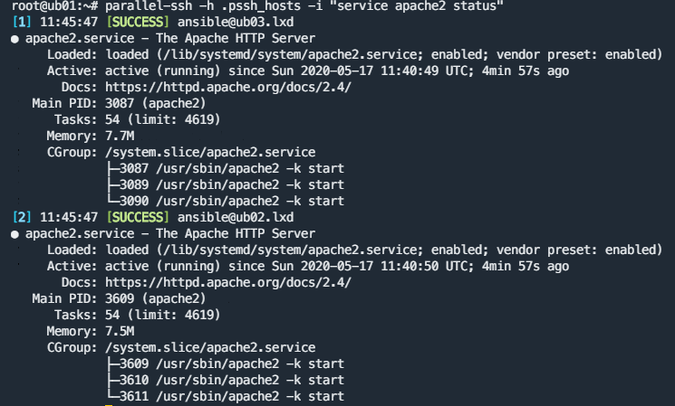

# Task 

Research and implement PSSH (Parallel SSH) setup that consists of three machines - one from which to run the PSHH and two others on which you must install Apache with a custom index page

# Used Sources

- [Installation Guide](https://parallel-ssh.readthedocs.io/en/latest/installation.html)

- [How to use parallel ssh (PSSH) for executing commands in parallel on a number of Linux/Unix/BSD servers](https://www.cyberciti.biz/cloud-computing/how-to-use-pssh-parallel-ssh-program-on-linux-unix/)

- [Enable sudo without password in Ubuntu/Debian](https://phpraxis.wordpress.com/2016/09/27/enable-sudo-without-password-in-ubuntudebian/)

# Solution

Install pssh

```
sudo apt install pssh
```

Generate a key for the new user.

I will be using "ansible" user.

```
ssh-keygen
ssh-copy-id ansible@ub02.lxd
ssh-copy-id ansible@ub03.lxd
```

Add paswordless execution of commands:

```
sudo visudo

# Paste in the end of hte file:

ansible ALL=(ALL) NOPASSWD:ALL

# Note: this is very bad practice?
```

# Instal apache on both servers

```
parallel-ssh -h .pssh_hosts -i "sudo apt install apache2 -y"
parallel-ssh -h .pssh_hosts -i "service apache2 status"
```

Screenshot:




Create custom index.html file

```bash
parallel-ssh -h .pssh_hosts -i -- 'echo "<h1>Hello from $HOSTNAME</h1>" | sudo tee /var/www/html/index.html
```

Test the file:

```
root@ub01:~# curl ub02.lxd
<h1>Hello from ub02</h1>
root@ub01:~# curl ub03.lxd
<h1>Hello from ub03</h1>
```